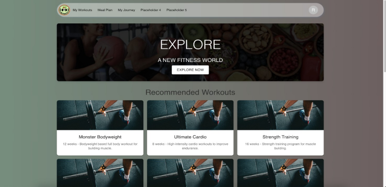
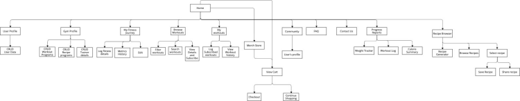

# NutriFit

NutriFit is a comprehensive web application designed to help users achieve their health and wellness goals by combining fitness routines with dietary planning. It provides tools for discovering new exercises, tracking workouts, and creating or finding recipes that meet dietary requirements.

- **Application URL:** [NutriFit](https://csci5709s24group07.netlify.app/)



## Features

- **Workout Library and Tracking:** Explore workout programs, track progress, and manage your fitness journey.
- **Recipe Library and Builder:** Browse food recipes and generate new recipes based on available ingredients and dietary preferences using AI.
- **E-Commerce Store:** Browse and purchase fitness equipment and merchandise.
- **Workout Management:** Gym representatives can create and manage workout programs.
- **Community Support:** Engage with other users and gym staff through a community space.
- **Notifications and Reminders:** Set reminders for tracking workouts and dietary measurements.

## Architecture



## Project Objectives

1. **Facilitate Access to Workouts and Dietary Plans:** Provide a knowledge base of exercises and an AI-generated recipe builder.
2. **Enhance User Engagement and Progress Tracking:** Log workouts, track progress, and generate detailed reports.
3. **Promote a Healthy Lifestyle:** Offer expert-made recipes and a customizable meal planning platform.
4. **Build a Community:** Create a space for users to share their fitness journeys and interact with gym staff.
5. **Expand Features:** Include an e-commerce store, donation functionalities, and administrator tools.


## Tech Stack

### Frontend

- **[React JS](https://react.dev/learn)**: A JavaScript library for building user interfaces.
- **[Material-UI](https://mui.com/material-ui/getting-started/)**: A library of React components that implements Google's Material Design.
- **[Emotion](https://emotion.sh)**: A library for writing CSS styles with JavaScript.
- **[React Router](https://reactrouter.com/)**: A library for handling routing in React applications.
- **[React Scripts](https://create-react-app.dev/docs/advanced-configuration/)**: A set of scripts for creating React applications with minimal configuration.
- **[Web Vitals](https://web.dev/vitals/)**: A library for measuring the quality of user experience.
- **[@testing-library/react](https://testing-library.com/docs/react-testing-library/intro/)**: A library for writing unit and integration tests for React components.

### Backend

- **[Node.js](https://nodejs.org/)**: A JavaScript runtime built on Chrome's V8 JavaScript engine.
- **[Express](https://expressjs.com/)**: A minimal and flexible Node.js web application framework.
- **[MongoDB](https://www.mongodb.com/)**: A NoSQL database for storing and managing data.
- **[Mongoose](https://mongoosejs.com/)**: An ODM (Object Data Modeling) library for MongoDB and Node.js.

### Deployment

- **[Netlify](https://www.netlify.com/)**: A platform for deploying and hosting modern web applications.
- **[GitHub](https://github.com/)**: A platform for version control and collaboration.

## User Personas

1. **Emma Johnson – A Busy Professional**
   - Uses the app for quick, tailored workouts during a short break.

2. **Lisa Chen – The Health-Conscious Parent**
   - Utilizes the Recipe Builder to create healthy, family-friendly meals.

3. **Jake Thompson – The Fitness Enthusiast**
   - Logs detailed workout routines and tracks progress to achieve fitness goals.

## Application Design

### Home Page
Features a welcoming banner, motivational imagery, and an "Explore Now" button for easy access to core functionalities.

### FAQ Page
Uses an accordion format to display frequently asked questions for quick information access.

### Contact Us Page
Includes a Google Map and contact form, providing users with multiple ways to reach out.

### Wireframes
Provides visual representations of various features including workout programs, recipe builder, and progress reports.

## Application Workflow

1. **Profile Management:** Users can create and update their profiles with personal and fitness information.
2. **Log Progress Reports:** Track workouts, weight changes, and calorie intake.
3. **Notifications and Reminders:** Set reminders for health tracking and fitness goals.
4. **Frequently Asked Questions:** Provides quick solutions to common issues.

## Getting Started

To get started with NutriFit, follow these steps:

1. Clone the repository:

2. Navigate to the project directory:
   ```bash
   cd Nutrifit
   ```

3. Install the necessary dependencies:
   ```bash
   npm install
   ```

4. Start the development server:
   ```bash
   npm start
   ```

5. Open your browser and visit `http://localhost:3000` to see the application in action.

## Contributing

We welcome contributions to NutriFit. Please follow these steps to contribute:

1. Fork the repository.
2. Create a new branch (`git checkout -b feature/YourFeature`).
3. Make your changes and commit them (`git commit -am 'Add new feature'`).
4. Push to the branch (`git push origin feature/YourFeature`).
5. Create a new Pull Request.

## Acknowledgements

- **Material UI:** For the design components.
- **Google Maps API:** For location integration.
- **OpenAI:** For AI-powered recipe generation.
